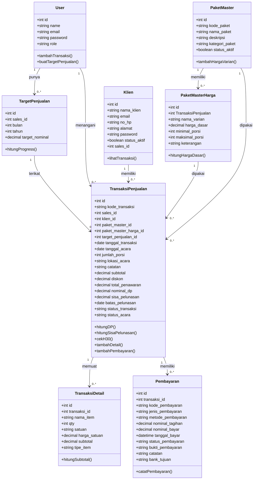
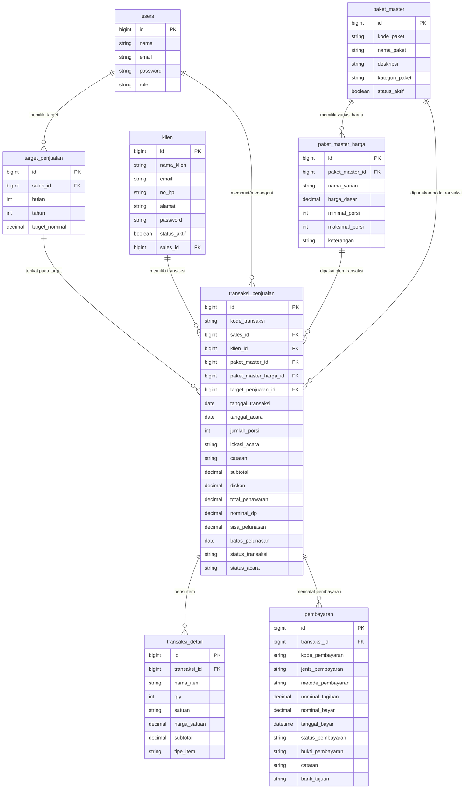

# DOKUMENTASI TAHAP 1 - ALUR DATA & LOGIKA BISNIS
## Sistem Monitoring Sales Performance - NABILLA CATERING

---

## 1. PENJELASAN ALUR DATA ANTAR TABEL

### Diagram Alur Data

```
┌─────────────┐
│   USERS     │ (Superadmin, Pemilik, Sales)
│  (Tabel:    │
│   users)    │
└──────┬──────┘
       │
       ├─────────────────────────────────────────────────┐
       │                                                 │
       ▼                                                 ▼
┌──────────────────┐                          ┌──────────────────┐
│ PAKET MASTER     │                          │ TARGET PENJUALAN │
│ (Tabel:          │                          │ (Tabel:          │
│  paket_master)   │                          │  target_penjualan)
│                  │                          │                  │
│ Dikelola oleh:   │                          │ Milik: Sales     │
│ PEMILIK SAJA     │                          │ Target per bulan │
└──────┬───────────┘                          └────────┬─────────┘
       │                                              │
       ├─ FK paket_master_id ────────┐              │
       │                             │              │
       ▼                             ▼              │
┌────────────────────────┐   ┌────────────────────┐│
│ PAKET MASTER HARGA     │   │   TRANSAKSI        ││
│ (Tabel:                │   │   PENJUALAN        ││
│  paket_master_harga)   │   │   (Tabel:          ││
│                        │   │    transaksi_      ││
│ Harga dasar/master     │   │    penjualan)      ││
│ Varian harga per paket │   │                    ││
└───────────────────────┘    │ Dibuat oleh: SALES ││
                             │ Diisi klien ke:    ││
                             │ PORTAL KLIEN       ││
                             └─────┬──────────────┘│
                                   │               │
                                   ├───────────────┘
                                   │
                    ┌──────────────┼──────────────┐
                    │              │              │
                    ▼              ▼              ▼
            ┌───────────────┐  ┌──────────┐  ┌────────────┐
            │   TRANSAKSI   │  │ PEMBAYARAN  │ │NOTIFIKASI  │
            │   DETAIL      │  │ (Tabel:    │ │PELUNASAN   │
            │  (Tabel:      │  │ pembayaran)│ │(Tabel:     │
            │  transaksi_   │  │           │ │ notifikasi_│
            │  detail)      │  │ DP & Pelun│ │ pelunasan) │
            │               │  │ Metode:   │ │            │
            │Item per       │  │ cash/bank │ │Alert H-30  │
            │transaksi      │  │ /midtrans │ │reminder    │
            └───────────────┘  └───────────┘  └────────────┘
                                     
┌──────────────┐
│    KLIEN     │ (Akun portal klien)
│  (Tabel:    │
│   klien)    │ Login: email + password (klien)
└──────┬──────┘ Hanya bisa lihat transaksi miliknya
       │        (Read-only)
       │
       └─── Akses via Portal Klien
           Melihat:
           - Transaksi miliknya
           - Paket yang dipilih
           - Total tagihan
           - Status DP & Pelunasan
           - Riwayat pembayaran
           - Alert H-30
```

---

## 2. ALUR BISNIS TRANSAKSI PENJUALAN (END-TO-END)

### Fase 1: Persiapan (Pemilik)
```
1. PEMILIK LOGIN
   └─> Dashboard Pemilik
       └─> Menu: Paket & Harga Master
           └─> CREATE/EDIT Paket Master dan Harga Dasar
               
Contoh:
- Paket Pernikahan Silver: Rp 35.000 per porsi (minimal 300)
- Paket Pernikahan Gold: Rp 50.000 per porsi (minimal 300)
- Paket Aqiqah: Rp 28.000 per box
```

### Fase 2: Proses Penjualan (Sales)
```
1. SALES LOGIN
   └─> Dashboard Sales
       └─> Menu: Transaksi Penjualan
           
2. SALES: Pilih/Tambah Klien
   └─> Cari klien dari tabel klien, atau tambah klien baru
   
3. SALES: Pilih Paket Master
   └─> Lihat paket master & harga dasar
   └─> Misal: Paket Pernikahan Silver 300 Pax @ Rp 35.000
   
4. SALES: Buat Penawaran
   └─> Input detail transaksi:
       - Tanggal acara
       - Jumlah porsi (bisa berubah dari paket master)
       - Lokasi acara
       - Catatan khusus
       
5. SALES: Hitung Harga Penawaran
   └─> Subtotal = jumlah_porsi × harga_satuan
   └─> Diskon (opsional)
   └─> Total Penawaran = subtotal - diskon
   
   Contoh:
   - Paket dasar: 350 porsi × Rp 35.000 = Rp 12.250.000
   - Diskon: Rp 0
   - Total Penawaran: Rp 12.250.000
   
6. SALES: Simpan Transaksi
   └─> Status transaksi: "menunggu_dp"
   └─> Sistem otomatis hitung DP 10%
   
7. SISTEM: Hitung Pembayaran Otomatis
   └─> nominal_dp = total_penawaran × 10% = Rp 1.225.000
   └─> sisa_pelunasan = total_penawaran - nominal_dp = Rp 11.025.000
   └─> batas_pelunasan = tanggal_acara - 30 hari
   
   Contoh:
   - Tanggal acara: 30 Agustus 2026
   - Batas pelunasan: 31 Juli 2026
   - Alert H-30 jika belum lunas pada tanggal ini
```

### Fase 3: Pembayaran (Sales)
```
1. SALES: Record Pembayaran DP
   └─> Menu: Pembayaran
   └─> Input:
       - Transaksi ID
       - Jenis pembayaran: DP
       - Metode: cash / transfer / midtrans
       - Nominal: sesuai tagihan DP
       - Tanggal bayar
       - Bukti pembayaran (jika ada)
   
2. SISTEM: Update Status Transaksi
   └─> Status transaksi: "dp_terbayar"
   └─> Status pembayaran: "berhasil"
   
3. KLIEN MELIHAT DI PORTAL
   └─> Transaksi status berubah menjadi "dp_terbayar"
   └─> Sisa pelunasan masih menunggu
   
4. SALES: Record Pembayaran Pelunasan
   └─> Menu: Pembayaran
   └─> Input:
       - Transaksi ID
       - Jenis pembayaran: pelunasan
       - Metode: cash / transfer / midtrans
       - Nominal: sesuai tagihan pelunasan
       - Tanggal bayar
       - Bukti pembayaran
   
5. SISTEM: Update Status Transaksi
   └─> Status transaksi: "lunas" (jika pembayaran = sisa pelunasan)
   └─> Status pembayaran: "berhasil"
   
6. KLIEN MELIHAT DI PORTAL
   └─> Transaksi status berubah menjadi "lunas"
   └─> Alert H-30 hilang (transaksi sudah lunas)
```

### Fase 4: Monitoring (Klien via Portal Klien)
```
1. KLIEN LOGIN PORTAL
   └─> Email yang terdaftar di tabel klien
   └─> Password klien
   
2. KLIEN MELIHAT:
   └─> Dashboard Portal Klien
       ├─ Daftar transaksi miliknya
       ├─ Paket yang dipilih
       ├─ Total tagihan
       ├─ Status DP
       ├─ Status pelunasan
       ├─ Riwayat pembayaran
       └─ Alert H-30 (jika belum lunas dan sudah H-30)
       
3. KLIEN TIDAK BISA:
   └─ Mengedit transaksi
   └─ Mengubah harga
   └─ Menambah paket
   └─ Membuat transaksi sendiri
   └─ Melihat data klien lain
```

---

## 3. LOGIKA BISNIS PEMBAYARAN

### DP 10% (Uang Muka)

**Rumus:**
```
nominal_dp = total_penawaran × 10 / 100
```

**Contoh Perhitungan:**
```
Total Penawaran = Rp 12.250.000

nominal_dp = 12.250.000 × 10 / 100
nominal_dp = 1.225.000 ✅

sisa_pelunasan = 12.250.000 - 1.225.000 = Rp 11.025.000
```

**Tabel: Pembayaran untuk Transaksi 12.250.000**
| Item | Nominal | Status | Catatan |
|------|---------|--------|---------|
| DP (10%) | Rp 1.225.000 | Pending → Berhasil | Harus dibayar dulu |
| Pelunasan (90%) | Rp 11.025.000 | Pending → Berhasil | Dibayar setelah DP lunas |
| **Total** | **Rp 12.250.000** | | |

---

### Batas Pelunasan H-30 Sebelum Acara

**Rumus:**
```
batas_pelunasan = tanggal_acara - 30 hari
```

**Contoh:**
```
Tanggal acara: 30 Agustus 2026
batas_pelunasan = 30 Agustus - 30 hari = 31 Juli 2026

Jika hari ini 1 Juli 2026:
- Sisa hari: 30 hari (H-30) ✅
- Status: Normal, belum perlu alert

Jika hari ini 2 Agustus 2026:
- Sisa hari: kurang dari 30 hari ❌
- Status: ALERT H-30! Pelunasan harus segera dilakukan!
```

**Logika Alert H-30:**
```python
def check_h30_alert(tanggal_acara, status_transaksi):
    hari_sisa = (tanggal_acara - today()).days
    
    if hari_sisa <= 30 and status_transaksi != "lunas":
        # ALERT H-30!
        return "ALERT"
    else:
        return "OK"

Contoh:
- Transaksi belum lunas, sisa hari 20 hari → ALERT ❌
- Transaksi sudah lunas, sisa hari 20 hari → OK ✅
- Transaksi belum lunas, sisa hari 40 hari → OK ✅
```

**Tempat Alert Ditampilkan:**
1. Dashboard Pemilik: Daftar transaksi yang mendekati H-30
2. Dashboard Sales: Daftar transaksi klien yang mendekati H-30
3. Portal Klien: Alert merah jika transaksi belum lunas dan H-30
4. Tabel notifikasi_pelunasan: Simpan reminder untuk history

---

## 4. LOGIKA BISNIS TARGET PENJUALAN

### Konsep Target Penjualan Per Sales

**Tabel: target_penjualan**
```sql
sales_id = Rina (Sales 1)
bulan = 7
tahun = 2026
target_nominal = Rp 50.000.000 (target penjualan bulan Juli)
```

### Perhitungan Progress Target

**Rumus:**
```
total_penjualan_bulan = SUM(total_penawaran) 
                        WHERE sales_id = X 
                        AND MONTH(tanggal_transaksi) = 7
                        AND YEAR(tanggal_transaksi) = 2026
                        AND status_transaksi != 'batal'

persentase_pencapaian = (total_penjualan_bulan / target_nominal) × 100

sisa_target = target_nominal - total_penjualan_bulan
```

**Contoh:**
```
Sales: Rina
Target Juli 2026: Rp 50.000.000

Transaksi bulan Juli:
1. Transaksi 1: Rp 12.250.000 (Pernikahan Silver)
2. Transaksi 2: Rp 8.000.000 (Aqiqah)
3. Transaksi 3: Rp 15.000.000 (Syukuran)
─────────────────────────────
Total penjualan: Rp 35.250.000

Perhitungan:
- Persentase = (35.250.000 / 50.000.000) × 100 = 70.5%
- Sisa target = 50.000.000 - 35.250.000 = Rp 14.750.000
- Status: "Hampir Tercapai" (70.5% ≥ 75%? NO → "Hampir Tercapai")
```

### Status Target

```
if persentase_pencapaian >= 100:
    status = "TERCAPAI" ✅
elif persentase_pencapaian >= 75:
    status = "HAMPIR TERCAPAI" ⚠️
else:
    status = "BELUM TERCAPAI" ❌
```

### Kontribusi Transaksi ke Target

Setiap transaksi yang dibuat sales HARUS dikaitkan dengan target penjualan bulan berjalan:

```php
// Saat create transaksi:
$transaksi = TransaksiPenjualan::create([
    'sales_id' => $sales1->id,
    'target_penjualan_id' => $target_juli->id, // ← Link ke target bulan ini
    'total_penawaran' => 12250000,
    ...
]);

// Maka total_penjualan sales akan terupdate:
// target_juli->total_penjualan += 12250000
```

---

## 5. PEMISAHAN HARGA MASTER vs HARGA PENAWARAN

### Tabel Paket Master (Dikelola Pemilik)

| Paket | Harga Dasar | Minimal | Maksimal | Kategori |
|-------|-------------|---------|----------|----------|
| Pernikahan Silver | Rp 35.000 | 300 | 400 | Pernikahan |
| Pernikahan Silver | Rp 33.000 | 500 | 600 | Pernikahan |
| Pernikahan Gold | Rp 50.000 | 300 | 400 | Pernikahan |
| Aqiqah | Rp 28.000 | 100 | 200 | Acara Keluarga |

**Tujuan:** Acuan harga dari Pemilik untuk semua sales

---

### Tabel Transaksi Penjualan (Dibuat Sales)

Saat Sales membuat transaksi, harga BISA BERBEDA dari harga master:

| Klien | Paket Master | Qty | Harga Satuan | Subtotal | Diskon | Total |
|-------|--------------|-----|--------------|----------|--------|-------|
| Adi | Pernikahan Silver | 350 | Rp 35.000 | 12.250.000 | 0 | 12.250.000 |
| Siti | Aqiqah | 150 | Rp 28.000 | 4.200.000 | 200.000 | 4.000.000 |

**Penjelasan:**
- Klien Adi: menggunakan harga master persis (Rp 35.000)
- Klien Siti: menggunakan harga master (Rp 28.000) + diskon Rp 200.000

**Mengapa Boleh Berbeda?**
```
✅ DIBOLEHKAN perubahan di tingkat transaksi:
   - Negosiasi harga dengan klien
   - Tambahan menu / dekorasi
   - Diskon khusus untuk klien loyal
   - Biaya lokasi / pengiriman
   - Request custom dari klien

❌ TIDAK BOLEH diubah di harga master:
   - Harga master adalah acuan resmi dari Pemilik
   - Pemilik yang mengontrol harga master
   - Sales hanya menggunakan sebagai dasar negosiasi
```

---

## 6. RELASI KLIEN DENGAN TRANSAKSI

### Tabel Klien

```sql
id: 1
nama_klien: Adi Wijaya
email: adi.wijaya@email.com
password: [hashed password untuk portal klien]
status_aktif: true
```

**Tujuan Ganda Tabel Klien:**
1. **Data Klien** (untuk Sales) → Data penerima catering
2. **Akun Portal Klien** → Login klien untuk melihat transaksi

### Alur Klien Melihat Transaksi

```
1. KLIEN LOGIN PORTAL
   └─> Email: adi.wijaya@email.com
   └─> Password: [klien password]
   └─> Auth menggunakan guard 'klien' (bukan 'web')

2. SISTEM QUERY TRANSAKSI
   └─> SELECT * FROM transaksi_penjualan 
       WHERE klien_id = 1
   └─> Hanya transaksi milik klien ID=1 yang ditampilkan

3. KLIEN LIHAT DI PORTAL
   └─> Transaksi Pernikahan Silver (TRX-2026-0001)
       ├─ Paket: Pernikahan Silver
       ├─ Tanggal acara: 30 Agustus 2026
       ├─ Total tagihan: Rp 12.250.000
       ├─ Status DP: Pending (Rp 1.225.000)
       ├─ Status Pelunasan: Pending (Rp 11.025.000)
       └─ Alert: H-30 Reminder!
```

---

## 7. KONTROL AKSES BERDASARKAN ROLE

### User Internal (users table) vs Klien (klien table)

```
╔════════════════════════════════════════════════════╗
║           USERS TABLE (Internal)                  ║
║     superadmin / pemilik / sales                  ║
╠════════════════════════════════════════════════════╣
║ Guard: 'web'                                      ║
║ Login: Email + Password                           ║
║ Session: Internal Dashboard                       ║
║ Akses: Semua menu sesuai role                     ║
║ Auth: middleware('auth')                          ║
╚════════════════════════════════════════════════════╝

vs

╔════════════════════════════════════════════════════╗
║           KLIEN TABLE (External)                  ║
║         Portal Klien (Read-Only)                  ║
╠════════════════════════════════════════════════════╣
║ Guard: 'klien' (custom)                           ║
║ Login: Email + Password                           ║
║ Session: Portal Klien                             ║
║ Akses: Hanya transaksi miliknya (read-only)       ║
║ Auth: middleware('auth:klien')                    ║
╚════════════════════════════════════════════════════╝
```

---

## 8. KODE TRANSAKSI AUTO-GENERATE

Sistem harus auto-generate kode transaksi unik:

```php
// Format: TRX-YYYY-NNNN
// Contoh: TRX-2026-0001, TRX-2026-0002, dst

function generateKodeTransaksi() {
    $tahun = now()->year;
    $lastTransaksi = TransaksiPenjualan::whereYear('created_at', $tahun)
        ->latest('id')
        ->first();
    
    $nomor = $lastTransaksi ? 
             (int)substr($lastTransaksi->kode_transaksi, -4) + 1 : 1;
    
    return sprintf('TRX-%d-%04d', $tahun, $nomor);
}
```

Juga untuk kode pembayaran:
```php
// Format: PAY-YYYY-NNNN
// Contoh: PAY-2026-0001, PAY-2026-0002, dst
```

---

## 9. RINGKASAN ALUR DATA

```
┌─────────────────────────────────────────────────────────────┐
│ 1. PEMILIK SETUP PAKET & HARGA MASTER                      │
│    └─> Paket Master + Paket Master Harga                   │
│                                                             │
│ 2. SALES BUAT TRANSAKSI PENJUALAN                          │
│    └─> Pilih paket master sebagai acuan                    │
│    └─> Buat harga penawaran (bisa berbeda dari master)     │
│    └─> Hitung DP 10% otomatis                              │
│    └─> Set batas_pelunasan = tanggal_acara - 30 hari       │
│    └─> Simpan ke tabel transaksi_penjualan                 │
│    └─> Sistem buat 2 record pembayaran (DP + Pelunasan)    │
│                                                             │
│ 3. SALES RECORD PEMBAYARAN                                 │
│    └─> Update tabel pembayaran                             │
│    └─> Update status transaksi                             │
│    └─> Sistem cek H-30, buat notifikasi jika perlu         │
│                                                             │
│ 4. KLIEN LOGIN PORTAL KLIEN                                │
│    └─> Query transaksi miliknya saja                       │
│    └─> Lihat paket, tagihan, status pembayaran             │
│    └─> Lihat alert H-30 jika belum lunas                   │
│                                                             │
│ 5. PEMILIK MONITORING                                      │
│    └─> Lihat semua transaksi                               │
│    └─> Lihat progress target sales                         │
│    └─> Lihat transaksi yang mendekati H-30                 │
└─────────────────────────────────────────────────────────────┘
```

---

## 10. CLASS DIAGRAM - SESUAI MODEL PROJECT SAAT INI

Berikut representasi class diagram yang disesuaikan dengan model dan kolom yang benar-benar ada di project saat ini, terutama pada folder app/Models dan migration terkait.


### Penjelasan alur tabel dan isi utama

1. User / akun internal
   - Menyimpan akun superadmin, pemilik, dan sales.
   - User bisa membuat target penjualan dan mengelola transaksi penjualan.

2. TargetPenjualan
   - Menyimpan target omzet per sales per bulan dan tahun.
   - Setiap transaksi penjualan dikaitkan ke satu target tertentu.

3. PaketMaster dan PaketMasterHarga
   - PaketMaster adalah acuan paket utama yang diatur oleh pemilik.
   - PaketMasterHarga adalah variasi harga yang bisa dipakai untuk transaksi.

4. Klien
   - Menyimpan data klien yang akan dihubungkan ke transaksi.
   - Klien tidak memakai akun internal yang sama dengan User.
   - Klien memiliki login terpisah di portal klien untuk melihat status transaksi dan riwayat pembayaran.

5. TransaksiPenjualan
   - Tabel utama proses penjualan.
   - Menyimpan nilai penawaran, DP, sisa pelunasan, batas pelunasan, dan status transaksi.

6. TransaksiDetail
   - Menyimpan rincian item atau layanan yang ada di transaksi.

7. Pembayaran
   - Menyimpan riwayat pembayaran DP maupun pelunasan.
   - Status pembayaran bisa pending, berhasil, atau gagal.


---

## 11. STRUKTUR DATABASE DIAGRAM ERD



Penjelasan singkat:
- users adalah akun internal untuk superadmin, pemilik, dan sales.
- klien adalah akun portal klien yang terhubung ke transaksi.
- transaksi_penjualan adalah pusat alur bisnis, lalu terhubung ke detail transaksi dan pembayaran.

NotifikasiPelunasan
├── id (PK)
├── transaksi_id (FK)
├── tipe_notifikasi
├── isi_notifikasi
├── tanggal_kirim
└── status_baca
```

---

## KESIMPULAN TAHAP 1

✅ **Selesai:**
- Analisis Role & Hak Akses (4 role: Superadmin, Pemilik, Sales, Klien)
- Migrations Database (9 tabel)
- Models Eloquent dengan relasi lengkap
- Seeder dummy data lengkap
- Dokumentasi alur data & logika bisnis

**Siap lanjut ke TAHAP 2**: Authentication, Layout, Dashboard, dan UI
